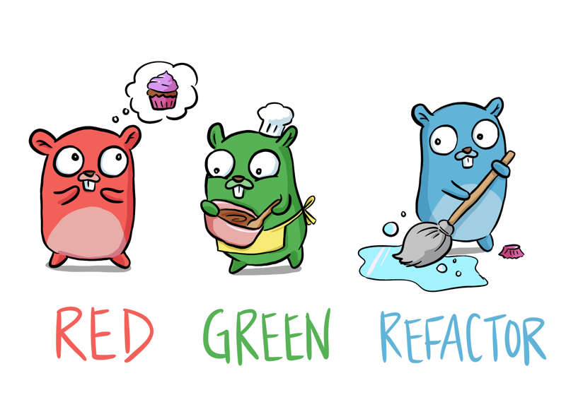

### Go Programming Language



Print Formatter (fmt.Printf)
| syntax | description|
| --- | --- |
| %v |the value in a default format |
when printing structs, the plus flag (%+v) adds field names
|%#v |a Go-syntax representation of the value|
(floating-point infinities and NaNs print as ±Inf and NaN)
|%T |a Go-syntax representation of the type of the value|
|%% |a literal percent sign; consumes no value|
| %t | the word true or false |

more info at https://pkg.go.dev/fmt

```
    package main

    import fmt

    func main(){
        var test string = "Go Language"
        fmt.Println(test)
    }
```
